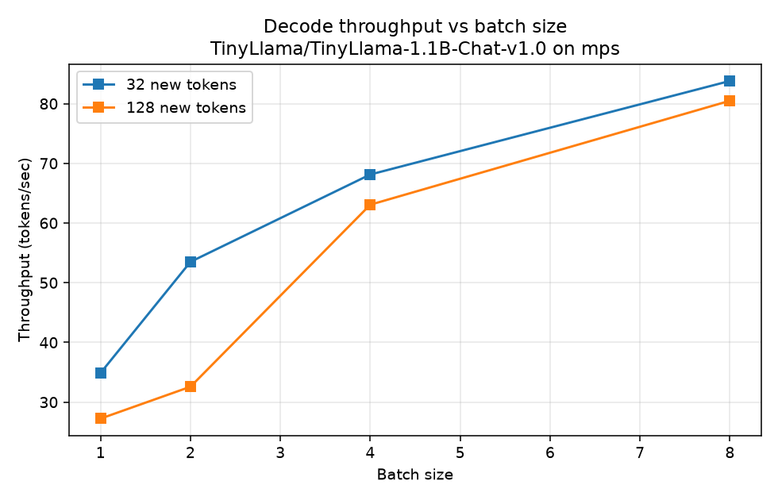
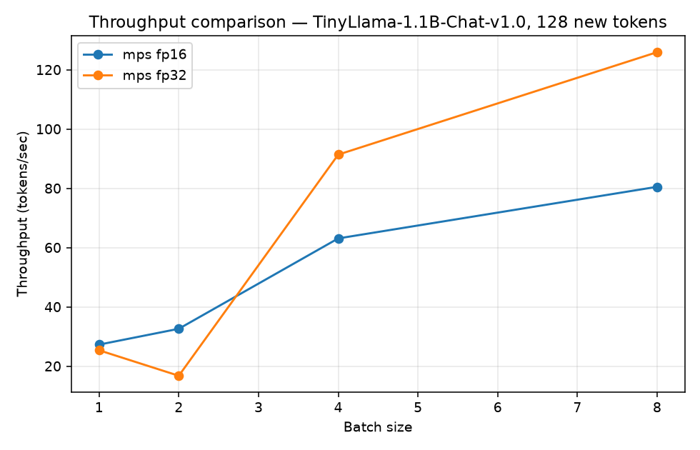
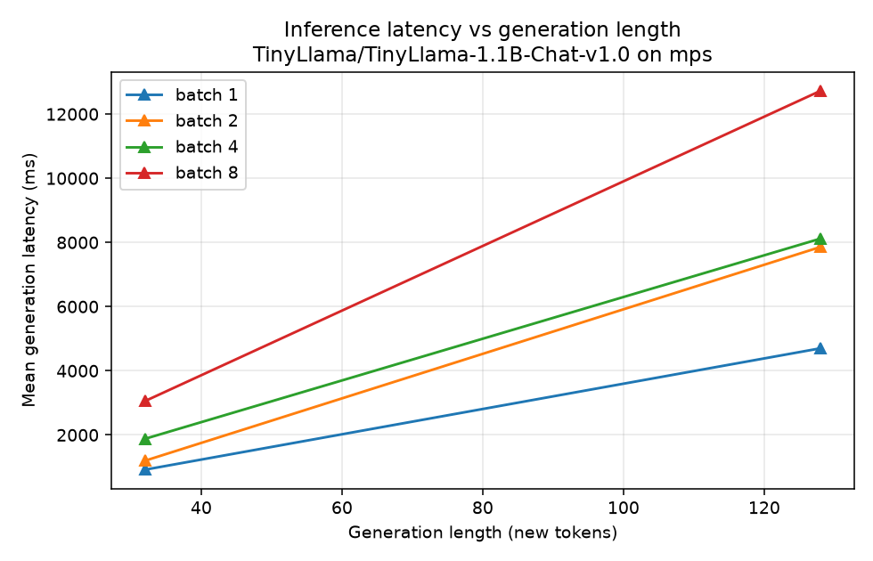

# LLM Inference Performance Benchmark

A small, reproducible harness for **data-driven analysis of how large language
model inference behaves across settings** — latency, throughput, and memory as a
function of batch size, generation length, hardware, and numerical precision.

The goal isn't to build a model; it's to answer the question a performance role
actually asks: *given a workload, how does it behave across the system, and where
do the time and memory go?*

> **New to LLM inference?** [**`GUIDE.md`**](GUIDE.md) explains every concept here
> from scratch — tokens, prefill vs decode, latency vs throughput, why batching
> helps, what fp16-vs-fp32 precision means, and the KV cache — no ML background
> assumed.

## What it measures

For a causal LM (default **`TinyLlama-1.1B`**, a real small LLM) it sweeps:

- **Batch size** — how well the workload uses the hardware's parallelism
- **Generation length** — the cost of the sequential decode loop
- **Precision** — fp32 vs fp16 (the memory/speed/accuracy lever)
- **Hardware** — CUDA GPU, Apple MPS, or CPU

and reports, per configuration: **mean latency** (± std), **decode throughput**
(tokens/sec), and **peak memory** (MB).

A separate **`profile_run.py`** uses `torch.profiler` for **operator-level
profiling** — the per-operator time breakdown plus an exportable timeline trace,
to see *where* the time goes, not just how much.

Methodology that makes the numbers trustworthy: untimed **warmup** runs, multiple
**timed repeats** (mean ± std), **device synchronisation** around timing, and
**fixed decode work** (`min_new_tokens == max_new_tokens`) so configs are
comparable.

## Running it

```bash
pip install -r requirements.txt

# Real 1.1B LLM, half precision, on the Apple GPU:
python benchmark.py --model TinyLlama/TinyLlama-1.1B-Chat-v1.0 --device mps --dtype fp16

# Same in full precision, to compare fp32 vs fp16:
python benchmark.py --model TinyLlama/TinyLlama-1.1B-Chat-v1.0 --device mps --dtype fp32

# Plots for one run, and a fp16-vs-fp32 comparison:
python plot_results.py results/benchmark_TinyLlama_TinyLlama-1.1B-Chat-v1.0_mps_fp16.csv
python compare.py results/..._mps_fp16.csv results/..._mps_fp32.csv

# Operator-level profiling (where the time goes) + a Chrome/Perfetto trace:
python profile_run.py --model distilgpt2 --new-tokens 16
```

## Results

Real numbers from **`TinyLlama-1.1B`** and (for the device comparison) `distilgpt2`
on an **Apple M-series (MPS)** GPU. Full data in [`results/`](results/).

### 1. Throughput scales with batch size



Batching several prompts together fills the GPU's idle compute units, so total
throughput rises with batch size (TinyLlama, fp16, 32 new tokens):

| Batch | Latency | Throughput |
|---:|---:|---:|
| 1 | 917 ms   | 34.9 tok/s |
| 2 | 1,196 ms | 53.5 tok/s |
| 4 | 1,879 ms | 68.1 tok/s |
| 8 | 3,055 ms | 83.8 tok/s |

Throughput **2.4×'d** (batch 1→8) while latency only ~3×'d — 8× the prompts for 3×
the wait. This is why real LLM services batch requests.

### 2. Precision: fp16 halves memory — but wasn't faster here (the interesting bit)



The textbook claim is that half precision (fp16) is *"half the memory and faster."*
Measuring it told a more nuanced story:

| | Peak memory | Peak throughput |
|---|---:|---:|
| **fp32** | 4,196 MB | **125.9 tok/s** |
| **fp16** | **2,098 MB** | 83.8 tok/s |

- **Memory: fp16 halved it, exactly as promised** (2.1 GB vs 4.2 GB) — the reliable,
  hardware-independent win.
- **Speed: fp16 was *not* faster on this hardware — fp32 actually won.** Apple's MPS
  backend evidently has better-optimised fp32 paths for this model than fp16.

That's the value of *measuring* over *assuming*: "fp16 is faster" holds on many
NVIDIA GPUs (dedicated 16-bit tensor cores) but **is not a universal law** — it
depends on the target hardware and software stack. (One fp32 data point, batch 2 ×
128 tokens, was a clear outlier at 16.7 tok/s — flagged as measurement noise, not
over-interpreted.)

### 3. Hardware: GPU vs CPU (distilgpt2)

| Config | CPU | MPS | MPS speedup |
|---|---:|---:|---:|
| batch 1, 32 tok  | 36.6  | 106.0 | 2.9× |
| batch 8, 32 tok  | 384.7 | 910.3 | 2.4× |
| batch 8, 128 tok | 353.0 | 371.3 | **1.05×** |

The GPU's advantage is largest at small batches and **collapses to near-parity at
the heaviest workload** — a reminder that the "faster" accelerator isn't uniformly
faster across the workload space.

### 4. Latency grows linearly with generation length



Because decode is autoregressive (each token depends on the previous one), latency
rises roughly linearly with the number of tokens generated — the sequential loop,
not per-token compute, dominates.

### 5. Profiling: where the time actually *goes* (operator-level)

Wall-clock numbers say *how fast*; `torch.profiler` says *where the time goes*.
Profiling one generation and aggregating by operator (`profile_run.py`):

| Operator | Self CPU % | What it is |
|---|---:|---|
| `aten::addmm` | 50% | Linear-layer matmuls (weight·x + bias) |
| `aten::mm` | 24% | More matmuls (the LM-head projection) |
| `scaled_dot_product_attention` | 3% | Attention |
| tanh / copy / view / … | rest | Activations and memory ops |

**~74% of inference time is matrix multiplication.** That one fact explains the
entire edge-AI hardware story: NPUs and GPU tensor cores are fundamentally
*matmul accelerators*, and quantization (int8/int4) speeds inference by making
those matmuls cheaper. Profiling turns *"the model is slow"* into *"the model is
matmul-bound — so target the matmuls."*

The run also exports `results/profile_trace.json` — a timeline **trace** you can
open in `chrome://tracing` or [Perfetto](https://ui.perfetto.dev).

## Key takeaways

- Batching trades latency for throughput; the win is real but has a ceiling (the "knee").
- fp16 reliably **halves memory**; whether it also speeds up is **hardware-dependent** — validate, don't assume.
- The "faster" device isn't uniformly faster; it depends on the workload.
- Profiling shows LLM inference is **~74% matrix multiplication** — which is exactly why matmul accelerators (tensor cores, NPUs) and quantization are the levers.
- These are exactly the questions an **edge-AI inference performance** role asks (see [`GUIDE.md`](GUIDE.md) §9).

## Possible extensions

- Add an **int8/int4 quantised** path (`torchao`/`optimum`) and compare accuracy vs speed vs memory.
- Add an **ONNX Runtime** path and compare against PyTorch eager.
- Profile the KV-cache memory directly to pinpoint where big batch × length becomes memory-bound.
- Plot a **latency/throughput Pareto frontier** across batch sizes.

---

Built as a focused portfolio piece on AI inference performance analysis.
