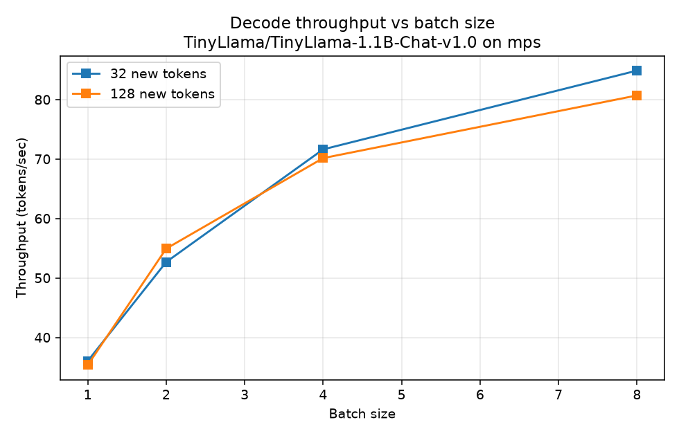
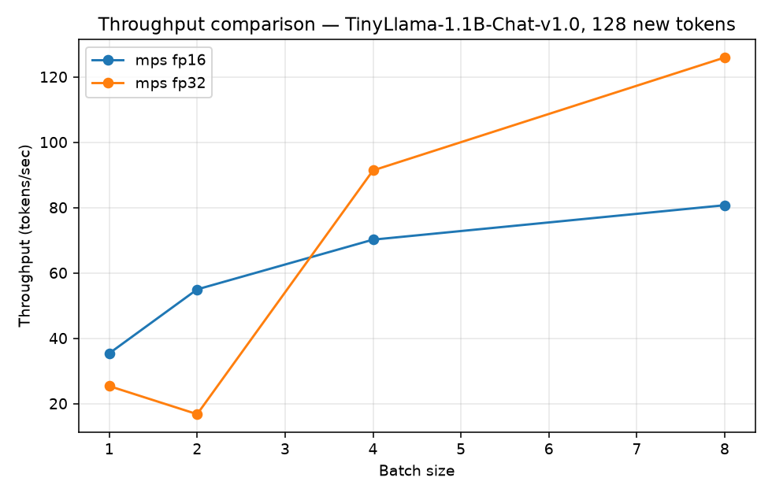
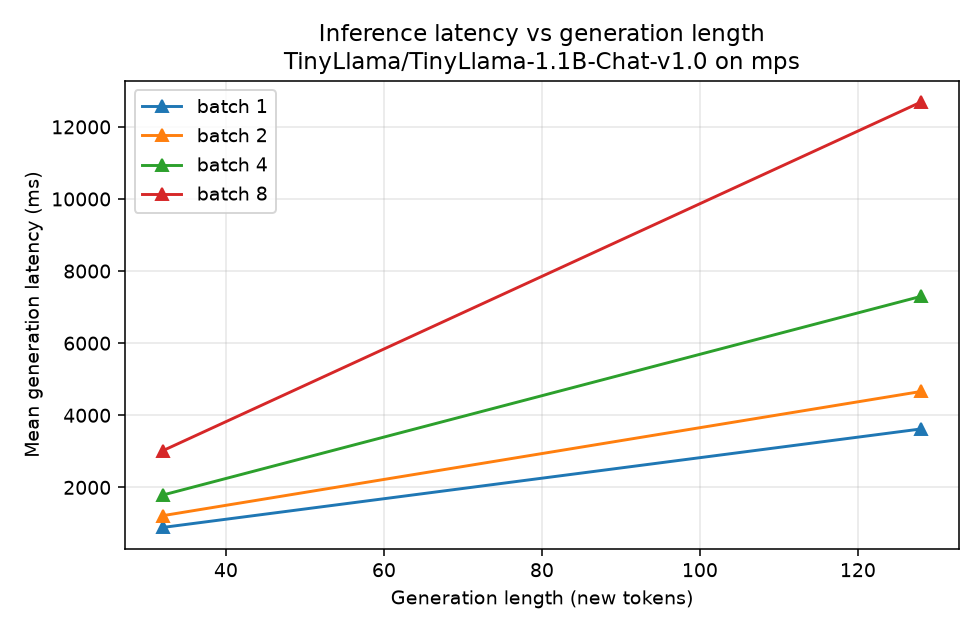
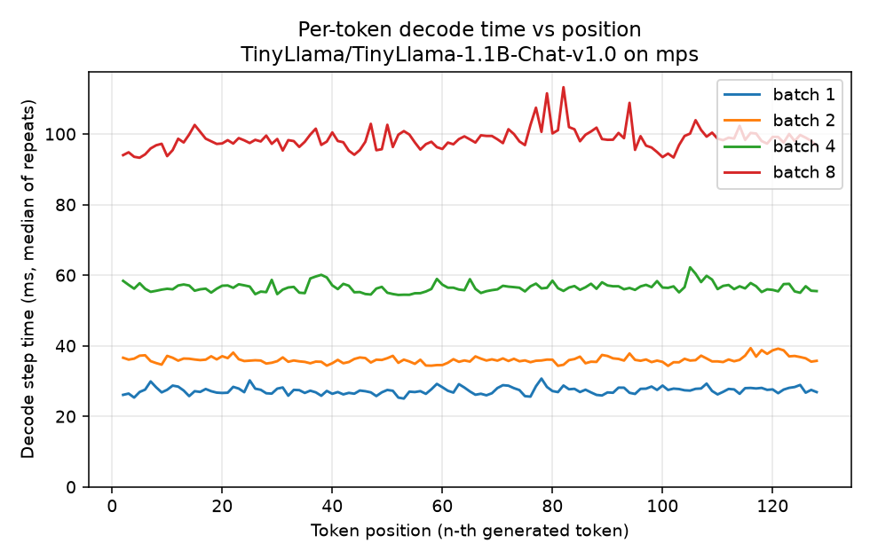

# LLM Inference Performance Benchmark

A small, reproducible harness for **data-driven analysis of how large language
model inference behaves across settings** — latency, throughput, and memory as a
function of batch size, generation length, hardware, and numerical precision.

The goal isn't to build a model; it's to answer a performance question: *given a
workload, how does it behave across the system, and where do the time and memory
go?*

## What it measures

For a causal LM (default **`TinyLlama-1.1B`**, a real small LLM) it sweeps:

- **Batch size** — how well the workload uses the hardware's parallelism
- **Generation length** — the cost of the sequential decode loop
- **Precision** — fp32 vs fp16 (the memory/speed/accuracy lever)
- **Hardware** — CUDA GPU, Apple MPS, or CPU

and reports, per configuration: **mean latency** (± std), **decode throughput**
(tokens/sec), and **peak memory** (MB). It also timestamps **every generated
token**, which gives **time to first token** (TTFT) and the **per-token decode
time** at each position in the output.

A separate **`profile_run.py`** uses `torch.profiler` for **operator-level
profiling** — the per-operator time breakdown plus an exportable timeline trace,
to see *where* the time goes, not just how much.

Methodology that makes the numbers trustworthy: untimed **warmup** runs, multiple
**timed repeats** (mean ± std), **device synchronisation** around timing, and
**fixed decode work** (`min_new_tokens == max_new_tokens`) so configs are
comparable. Per-token timestamps come from a `generate()` streamer, which is
called once per step after the token has been copied back from the device, so
they mark when each token actually finished rather than when it was queued.

## Running it

```bash
pip install -r requirements.txt

# Real 1.1B LLM, half precision, on the Apple GPU:
python benchmark.py --model TinyLlama/TinyLlama-1.1B-Chat-v1.0 --device mps --dtype fp16

# Same in full precision, to compare fp32 vs fp16:
python benchmark.py --model TinyLlama/TinyLlama-1.1B-Chat-v1.0 --device mps --dtype fp32

# Plots for one run, and a fp16-vs-fp32 comparison:
python plot_results.py results/benchmark_TinyLlama_TinyLlama-1.1B-Chat-v1.0_mps_fp16.csv
python compare.py results/..._mps_fp16.csv results/..._mps_fp32.csv

# Operator-level profiling (where the time goes) + a Chrome/Perfetto trace:
python profile_run.py --model distilgpt2 --new-tokens 16
```

## Results

Real numbers from **`TinyLlama-1.1B`** and (for the device comparison) `distilgpt2`
on an **Apple M-series (MPS)** GPU. Full data in [`results/`](results/).

### 1. Throughput scales with batch size



Batching several prompts together fills the GPU's idle compute units, so total
throughput rises with batch size (TinyLlama, fp16, 32 new tokens):

| Batch | Latency | Throughput |
|---:|---:|---:|
| 1 | 888 ms   | 36.0 tok/s |
| 2 | 1,215 ms | 52.7 tok/s |
| 4 | 1,787 ms | 71.6 tok/s |
| 8 | 3,017 ms | 84.9 tok/s |

Throughput **2.4×'d** (batch 1→8) while latency only ~3.4×'d — 8× the prompts for
3.4× the wait. This is why real LLM services batch requests.

### 2. Precision: fp16 halves memory — but wasn't faster here (the interesting bit)



The textbook claim is that half precision (fp16) is *"half the memory and faster."*
Measuring it told a more nuanced story:

| | Peak memory | Peak throughput |
|---|---:|---:|
| **fp32** | 4,196 MB | **125.9 tok/s** |
| **fp16** | **2,098 MB** | 84.9 tok/s |

- **Memory: fp16 halved it, exactly as promised** (2.1 GB vs 4.2 GB) — the reliable,
  hardware-independent win.
- **Speed: fp16 was *not* faster on this hardware — fp32 actually won.** Apple's MPS
  backend evidently has better-optimised fp32 paths for this model than fp16.

That's the value of *measuring* over *assuming*: "fp16 is faster" holds on many
NVIDIA GPUs (dedicated 16-bit tensor cores) but **is not a universal law** — it
depends on the target hardware and software stack. (One fp32 data point, batch 2 ×
128 tokens, was a clear outlier at 16.7 tok/s — flagged as measurement noise, not
over-interpreted.)

### 3. Hardware: GPU vs CPU (distilgpt2)

| Config | CPU | MPS | MPS speedup |
|---|---:|---:|---:|
| batch 1, 32 tok  | 36.6  | 106.0 | 2.9× |
| batch 8, 32 tok  | 384.7 | 910.3 | 2.4× |
| batch 8, 128 tok | 353.0 | 371.3 | **1.05×** |

The GPU's advantage is largest at small batches and **collapses to near-parity at
the heaviest workload** — a reminder that the "faster" accelerator isn't uniformly
faster across the workload space.

### 4. Latency grows linearly with generation length



Because decode is autoregressive (each token depends on the previous one), latency
rises linearly with the number of tokens generated: 32 tokens take 888 ms and 128
take 3,621 ms (4.1×) at batch 1.

### 5. Per-token timing: every token costs the same



End-to-end latency can't say *why* it's linear, so the benchmark also timestamps
each token as it's produced. For a 128-token generation (median of 3 runs):

| Batch | Time to first token | Per-token decode time |
|---:|---:|---:|
| 1 | 34 ms | 27 ms |
| 2 | 41 ms | 36 ms |
| 4 | 43 ms | 56 ms |
| 8 | 57 ms | 98 ms |

- **The per-token time is flat from token 2 to token 128** at every batch size.
  Each step reads all 1.1B weights (2.2 GB in fp16), while the KV cache tops out
  around 22 MB here, so the growing cache never shows up. It would only start to
  matter at contexts of thousands of tokens.
- **Latency ≈ time to first token + (N − 1) × per-token time.** At batch 1 that's
  34 + 127 × 27 ≈ 3.5 s for 128 tokens, close to the measured 3.6 s.
- **Batching, one step at a time:** a batch-8 step produces 8 tokens in 3.6× the
  time of a batch-1 step. That's where the throughput gain in §1 comes from.
- **Time to first token is small** (34–57 ms) because the prompt is only a few
  tokens; prefill barely registers next to decode.

### 6. Profiling: where the time actually *goes* (operator-level)

Wall-clock numbers say *how fast*; `torch.profiler` says *where the time goes*.
Profiling one generation and aggregating by operator (`profile_run.py`):

| Operator | Self CPU % | What it is |
|---|---:|---|
| `aten::addmm` | 50% | Linear-layer matmuls (weight·x + bias) |
| `aten::mm` | 24% | More matmuls (the LM-head projection) |
| `scaled_dot_product_attention` | 3% | Attention |
| tanh / copy / view / … | rest | Activations and memory ops |

**~74% of inference time is matrix multiplication.** That one fact explains the
entire edge-AI hardware story: NPUs and GPU tensor cores are fundamentally
*matmul accelerators*, and quantization (int8/int4) speeds inference by making
those matmuls cheaper. Profiling turns *"the model is slow"* into *"the model is
matmul-bound — so target the matmuls."*

The run also exports `results/profile_trace.json` — a timeline **trace** you can
open in `chrome://tracing` or [Perfetto](https://ui.perfetto.dev).

## Key takeaways

- Batching trades latency for throughput; the win is real but has a ceiling (the "knee").
- Each generated token costs the same (~27 ms at batch 1), so latency is linear in output length; at these context lengths the KV cache doesn't slow later tokens down.
- fp16 reliably **halves memory**; whether it also speeds up is **hardware-dependent** — validate, don't assume.
- The "faster" device isn't uniformly faster; it depends on the workload.
- Profiling shows LLM inference is **~74% matrix multiplication** — which is exactly why matmul accelerators (tensor cores, NPUs) and quantization are the levers.
- These are the questions that decide whether a model runs well on memory- and power-constrained **edge devices**.

## Possible extensions

- Add an **int8/int4 quantised** path (`torchao`/`optimum`) and compare accuracy vs speed vs memory.
- Add an **ONNX Runtime** path and compare against PyTorch eager.
- Profile the KV-cache memory directly to pinpoint where big batch × length becomes memory-bound.
- Plot a **latency/throughput Pareto frontier** across batch sizes.
